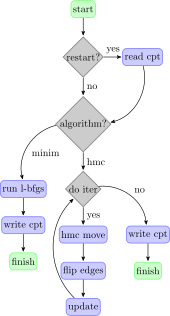

.. _cli:

Command line interface
======================

Trimem offers a command line application that is available after installation
as ``mc_app``. This application implements an interface to the following
simulation logic:

It offers the possibility to run either a minimization of the Helfrich
functional or a statistical exploration by means of Markov Chain Monte
Carlo sampling. Checkpointing allows for a versatile recombination of these
two steps. Please have a look at the :ref:`Quick-Start` tutorial for
an applied introduction.

cli reference
-------------

The command line interface ``mc_app`` can be queried with the ``--help`` flag
to provide a verbose help message:

.. command-output::  mc_app --help

The behavior of the application is controlled by an input configuration file.
A :ref:`default version <config-file>` can be generated by the ``config``
subcommand:

.. command-output:: mc_app config --help

A simulation parametrized by an input configuration file can then be run with
the ``run`` subcommand:

.. program-output:: mc_app run --help
